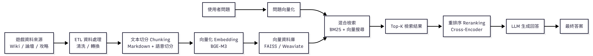

# 期中作業報告 - Game Strategy RAG System

## 一、專案介紹
本專案為一個基於 RAG（Retrieval-Augmented Generation）的遊戲攻略問答系統，
能夠從遊戲 Wiki、論壇與攻略資料中檢索資訊並生成答案。

---

## 二、系統架構

---

## 三、系統流程

1. 資料來源（Wiki / 論壇 / 攻略）
2. ETL 清洗與轉換
3. 文字切分（Chunking）
4. 向量化（Embedding - BGE-M3）
5. 向量資料庫（FAISS / Weaviate）
6. Hybrid Search（BM25 + 向量）
7. Reranking（Cross-Encoder）
8. LLM 生成答案

---

## 四、系統特色

- Hybrid Search（關鍵字 + 語意）
- Reranking 提升準確度
- 可解釋回答（附來源）

---

## 五、使用技術

- Python
- FAISS / Weaviate
- BGE-M3 Embedding Model
- LLM（Large Language Model）

---

## 六、GitHub Repository

（貼上你的 Repo 連結）
